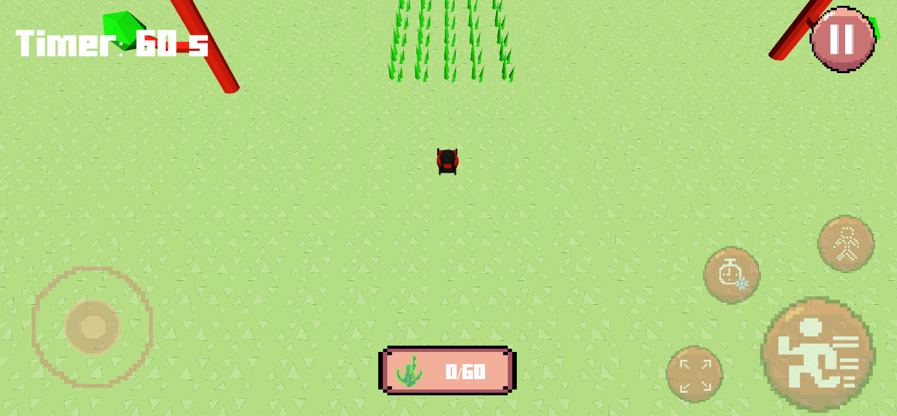

# Lawn Mower | Casual Game | Android

<!---Esses são exemplos. Veja https://shields.io para outras pessoas ou para personalizar este conjunto de escudos. Você pode querer incluir dependências, status do projeto e informações de licença aqui--->

> Lawn Mower is a Android game with +500 downloads in which you need to cut lawn in different levels. You have different powers and different challenges 

## 💻 Requirements

Before starting, make sure you've met the following requirements:
* Unity 2020,1,6f1.
* This game uses Admob SDK and Game Analytics SDK.
* This game uses Post Processing.

## 📫 Contributing to Lawn Mower

To contribute to Lawn Mower, follow these steps:

1. Fork this repository.
2. Create a branch: `git checkout -b <branch_name>`.
3. Make your changes and commit them: `git commit -m '<message_commit>'`
4. Push to the original branch: `git push origin <project_name> / <local>`
5. Create the pull request.

## 😄 Be one of the contributors 

Want to be part of this project? Click [HERE](CONTRIBUTING.md) and read how to contribute.

## 📝 License

This project is under license. See the [LICENSE](CC-BY-4.0.md) file for more details.

[⬆Back to the top](#SpaceBulletTime) 
